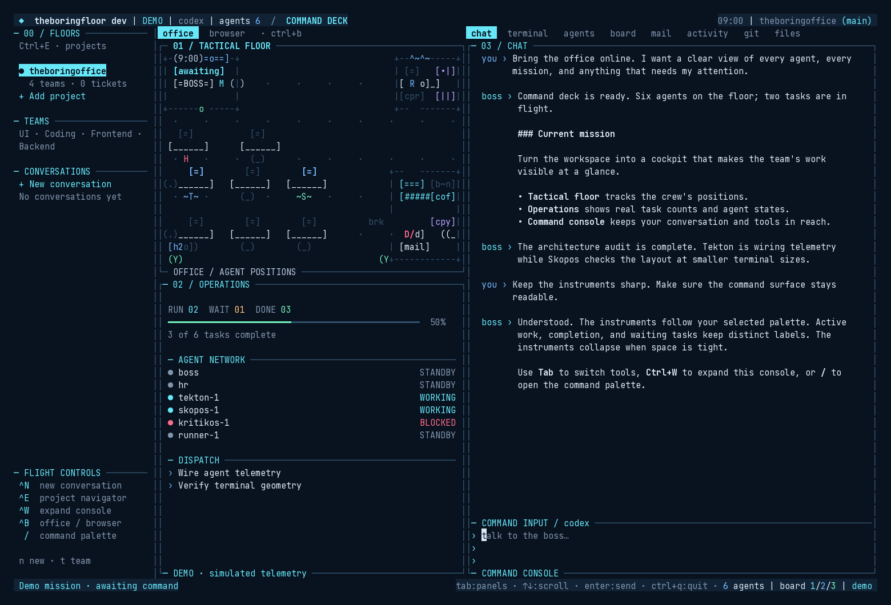
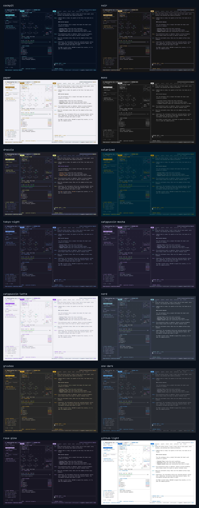

<div align="center">


# theboringfloor

**A startup office in your terminal, staffed by real agents.**

Chat with the boss. Watch the floor — employees walk, type, drop mail, hit the tea machine.
Floors stay on the left, the office lives in the middle, and transcripts and tools live on the right.

[Website](https://boringfloor.com) · [Docs](https://boringfloor.com/docs) · [Get started](https://boringfloor.com/get-started) · [Discord](https://discord.gg/YPDsHVHTVf)

<br />

[](https://go.dev)
[](https://github.com/theboringhumane/theboringfloor/releases)
[](https://github.com/theboringhumane/theboringfloor/actions/workflows/release.yml)
[](https://pkg.go.dev/github.com/theboringhumane/theboringfloor)
[](LICENSE)
[](https://discord.gg/YPDsHVHTVf)

</div>


[Project floors and workspaces](docs/workspaces.md): teams, persistent tickets, a project file explorer, conversation archives, and a choice of OpenCode, Claude Code, or Codex for each new conversation.

[Android companion](mobile/README.md): an attention inbox for plan reviews, blocked work, and tickets ready for review. Tickets link their conversations, acceptance criteria, result summaries, and recorded verification notes. Download the signed APK from [Releases](https://github.com/theboringhumane/theboringfloor/releases/latest).

Under the wallpaper it is real: the manager is **[Oikonomos](https://github.com/theboringhumane/oikonomos)**, employees are **opencode sub-agents**, the board combines **local tickets and agentmemory actions**, mail is **agentmemory signals**.

## Install

One-liner — binary plus [agentmemory](https://github.com/rohitg00/agentmemory) as a reboot-safe service:

```bash
curl -fsSL https://boringfloor.com/install.sh | sh
```

Windows (PowerShell):

```powershell
irm https://boringfloor.com/install.ps1 | iex
```

The Windows installer downloads the matching `theboringfloor_<version>_<os>_<arch>.tar.gz` release archive, verifies its SHA-256 checksum, and installs `theboringfloor.exe` (plus `tbo.exe`) in `%LOCALAPPDATA%\theboringfloor\bin`. It adds that directory to your user `PATH`; open a new PowerShell window, then run `theboringfloor --demo`. To install manually, download the matching `theboringfloor_<version>_<os>_<arch>.tar.gz` archive and checksums file from [Releases](https://github.com/theboringhumane/theboringfloor/releases), verify the checksum, then put `theboringfloor.exe` in a directory on your `PATH`.

Pick the LLM transport at install (`opencode` default; `claudecode` needs the [claude](https://docs.anthropic.com/en/docs/claude-code) CLI; `codex` needs the [Codex CLI](https://developers.openai.com/codex/cli)):

```bash
curl -fsSL https://boringfloor.com/install.sh | sh -s -- --backend claudecode
```

Then:

```bash
theboringfloor            # live office
theboringfloor --demo     # touring mode
theboringfloor --version  # stamp: version, commit, date
```

Pin a tag, or grab a prebuilt (macOS/Linux/Windows, amd64/arm64) from [Releases](https://github.com/theboringhumane/theboringfloor/releases):

```bash
go install github.com/theboringhumane/theboringfloor/cmd/theboringfloor@latest
```

Full on-ramp: **[Getting started](https://boringfloor.com/docs/getting-started)** · local notes in [`docs/`](docs/README.md).

## Docs

Manual lives on the site. This repo keeps a thin index so GitHub readers land in the right room.

| In-repo | Website |
|---|---|
| [Docs hub](docs/README.md) | [Docs home](https://boringfloor.com/docs) |
| [Project floors](docs/workspaces.md) | Teams, tickets, files, and Codex |
| [Model selection](docs/models.md) | Native catalogs, saved choices, and backend limits |
| [Architecture](docs/architecture.md) | [Vision](https://boringfloor.com/vision) |
| [Website](website/README.md) | [Get started](https://boringfloor.com/get-started) |
| [Commands (`cmd/`)](cmd/README.md) | [Sounds](https://boringfloor.com/sounds) |
| [Scripts](scripts/README.md) | [Blog](https://boringfloor.com/blog) |

### Manual (site)

**Install & setup**
- [Getting started](https://boringfloor.com/docs/getting-started) — curl, demo, live office, `--session`

**Core**
- [Backends](https://boringfloor.com/docs/backends) — OpenCode, Claude Code, or Codex
- [Chat & work threads](https://boringfloor.com/docs/chat-and-threads)
- [Plan mode](https://boringfloor.com/docs/plan-mode)
- [MCP server](https://boringfloor.com/docs/mcp-server) — let your configured agent read the office and present plan drafts

**Workflow**
- [Permissions & questions](https://boringfloor.com/docs/permissions-and-questions)
- [Queue, board & memory](https://boringfloor.com/docs/queue-board-memory)

**Panels & reference**
- [Terminal & git tabs](https://boringfloor.com/docs/terminal-and-git-tabs)
- [Browser tab](https://boringfloor.com/docs/browser-tab)
- [Layout, themes & power](https://boringfloor.com/docs/layout-themes-power)
- [Keys & slash commands](https://boringfloor.com/docs/keys-and-slash)

Config file: `~/.theboringfloor/configs/brain.json` (`theboringfloor --print-default-config`). Details: [backends](https://boringfloor.com/docs/backends) + [layout](https://boringfloor.com/docs/layout-themes-power).

### Cockpit control plane

Every theme now uses the cockpit layout: a tactical office grid, live
task-completion meter, agent network, dispatch list, and numbered tool consoles.
All 14 built-in palettes and imported VS Code themes supply their own colors;
switching themes keeps the instruments and controls. Instruments use the office's
actual state and collapse on short terminals. The default dark palette is
Cockpit; light terminals use Paper, and explicit theme choices stay pinned.

```bash
theboringfloor --demo --theme cockpit
# Inside a running office: /theme cockpit
# Same cockpit, classic palette: /theme noir
```



Reproduce the demo frame without starting a backend: `go run ./cmd/uishot --cockpit`.
Add `--theme paper` (or any other theme name) to preview the same cockpit in that palette.



### Make it yours

Choose from **Cockpit, Noir, Paper, Mono, Dracula, Solarized, Tokyo Night,
Catppuccin Mocha, Catppuccin Latte, Nord, Gruvbox, One Dark, Rosé Pine, and
GitHub Light**. Type `/theme ` and use the arrow keys to preview, Enter to save,
or Escape to return to your previous palette. `/themes` lists every available name.

Bring a local VS Code theme into the same picker:

```text
/theme import "/path/to/My Theme.json"
/theme custom-my-theme
```

Or import at startup: `theboringfloor --import-theme ./my-theme.jsonc`.
Look in `~/.vscode/extensions/<publisher.theme-version>/themes/` for an installed
extension's theme file; its `package.json` lists the paths under `contributes.themes`.

Customize any palette by exporting it, editing its `colors` or `tokenColors`,
then importing the result:

```text
/theme export ~/my-floor-theme.json
/theme import ~/my-floor-theme.json
```

The export uses VS Code's JSON format. Change `name` to give your palette a name.
Imports are saved as `custom-<name>` in `~/.config/theboringfloor/themes/`
(`$XDG_CONFIG_HOME/theboringfloor/themes/` when set). Reimport the same name to
update it, or edit its saved JSON and run `/theme reload`. The selection survives
restarts. Export refuses to overwrite an existing file.

Supported: JSON/JSONC, comments, trailing commas, relative local `include` files,
hex colors with transparency, and common TextMate syntax scopes for diff code.
VS Code editor, status-bar, border, button, terminal ANSI and diff colors map to
the cockpit's corresponding colors; omitted slots use dark/light defaults.
Imports adapt a palette to this terminal UI: VS Code-specific components,
semantic-token rules, complex language selectors, `.tmTheme` references and
extension packages are not imported. Use the extension's JSON theme file.

For OpenCode and Claude Code, the office primes the backend with the same manager charter before the first turn: the bundled [oikonomos](https://github.com/theboringhumane/oikonomos) protocol lands at `.opencode/oikonomos.md` in the served directory. On opencode the office merges `./.opencode/oikonomos.md` into `.opencode/opencode.json`'s `instructions` — a field-preserving merge, every other key survives. On claudecode it writes `CLAUDE.md`: created with `@.opencode/oikonomos.md` when absent, or — when you already keep one — an idempotent `<!-- theboringfloor charter -->` block appended below your content. Nothing member-owned is ever overwritten. Codex receives the bundled manager charter in its first prompt and uses its own CLI configuration.

## Peek

<p>
  
  
</p>


## Keys

One line per key — the full table lives at [keys & slash commands](https://boringfloor.com/docs/keys-and-slash).

### Agent plan tools

In plan mode, the boss can present or refresh the plan pane with explicit markers. These are agent-only protocol lines, not commands for members to type:

```text
⟦plan-present⟧
# Goal
Add the requested capability.

# Steps
1. Inspect the current flow.
2. Make the focused change.
⟦/plan-present⟧
```

```text
⟦plan-update⟧
# Goal
Add the requested capability with the clarified edge case.
⟦/plan-update⟧
```

`plan-present` and `plan-update` are multiline blocks. They fill the existing plan pane as a **draft**; they do not run work and they never bypass your approval. Review or edit the draft, then press `ctrl+x` twice to approve it. Only that second confirmation sends the plan to the build agent.

Once you have approved a plan, the office keeps that approved version across sessions (up to 20,000 runes). Later drafts and updates stay drafts: they do not replace the approved plan until you review and approve them. When the boss needs the current decision, it places this marker on its own line:

```text
⟦plan-get-approved⟧
```

The office sends the latest approved plan back to the boss. If there is no approved plan yet, it does not substitute a draft.

### MCP server and office control

`thefloor_mcp` is the MCP server for the office. It ships in the same release archive as `theboringfloor` and is registered automatically in your global OpenCode configuration; when the Claude CLI is present, it is also registered for Claude Code at user scope. It gives your configured agent a first-class path alongside the plan markers above — the markers still work.

| Tool | Args | What it does | Needs live office? |
|---|---|---|---|
| `plan_present` | `{text}` | presents a plan draft in the plan pane | yes |
| `plan_update` | `{text}` | updates the plan draft in the plan pane | yes |
| `plan_get_approved` | `{}` | reads the member-approved plan | no — live or on-disk |
| `transcript_read` | `{limit?}` | reads recent office transcript messages | no — live or on-disk |
| `transcript_search` | `{query, limit?}` | searches this project's recent transcript tail | no — on-disk, current project only |
| `office_status` | `{}` | reports whether the office is live, its backend, and message counts | no |

`plan_present` and `plan_update` only present drafts: they never execute work. Review or edit the draft, then press `ctrl+x` twice to approve it for the build agent. If the office is not running, these write tools return an error; they have no offline fallback.

The on-disk transcript is capped to its most recent 200 messages per project, so `transcript_search` searches that recent tail rather than complete history. It is scoped to the current project and cannot read another project's transcript.

| Environment variable | Effect |
|---|---|
| `THEFLOOR_NO_CONTROL=1` | disables the office control API |
| `THEFLOOR_NO_MCP_INSTALL=1` | disables automatic MCP registration |
| `THEFLOOR_PROJECT_DIR` | overrides the project directory that `thefloor_mcp` binds to |

The office control API listens only on loopback (`127.0.0.1`) on an ephemeral port and requires a bearer token. Its discovery file is `~/.theboringfloor/projects/<dirhash>/control.json`, mode `0600`; it holds the port and token for the current project.

| Key | Does |
|---|---|
| `tab` / `shift+tab` / `1..7` | switch the right panel: chat · terminal · agents · board · mail · activity · git |
| `ctrl+b` | flip the left pane: floor ↔ browser |
| `enter` | send to the boss — free-sends into the backlog while it's busy |
| `shift+enter` / `ctrl+j` | newline in the chat input |
| `@` | attach-file picker — type to filter, enter/tab attach |
| `ctrl+v` | paste text — attaches the image instead when the clipboard holds one |
| big paste | chat pastes >20 lines or >2000 chars collapse to a `[pasted N lines · M chars]` chip — one backspace unit, full text sent on submit |
| `/model` | open the active backend's native main-model catalog; `/model <native-ref>` sets a model manually |
| `/submodel` | pick a native agent type, then its model; `/submodel <agent>` opens its picker; `/submodel <agent> <native-ref>` sets a supported choice manually |
| `/model` · `/submodel` | type to filter, enter to select, esc cancels browsing; applying waits for acknowledgment — [backend limits](docs/models.md) |
| `/session` · `@` | pickers filter as you type — `N/M` badge, esc clears the filter, then closes |
| `y` `a` `n` `esc` | answer a permission prompt — allow once / always / reject / defer |
| click a tool row | expand what the tool returned (all kinds — capped, tail-kept; `no output as such` when there's none) |
| `⟦recent-messages⟧` / `⟦recent-messages: N⟧` | agent-only context recovery marker — on its own line once per reply; sends the boss the latest 20 messages by default, or `N` clamped to 1..50 |
| `/bypass` | toggle bypass-permissions mode — session-only, confirm-on-enable, ` ⚠ BYPASS ` rides the topbar while on |
| `ctrl+x` twice | plan mode: confirm and approve the current draft for the build agent |
| `ctrl+q` | arm quit — works everywhere |

`/bypass` is the deliberate escape hatch. Enabling asks for an explicit confirm — agents will run tools and browser actions WITHOUT asking, this office session only — disabling is instant. While on, every tab's topbar carries a loud ` ⚠ BYPASS ` segment, backend permission asks stop (claude spawns with `--dangerously-skip-permissions`; the office-owned opencode process gets an ephemeral `OPENCODE_CONFIG_CONTENT={"permission":{"*":"allow"}}` override), any stray ask is auto-approved with a dim log row, and the office's own browser-action prompt is skipped the same way. Toggling builds and starts a fresh backend before switching; the current backend stays usable until the replacement is live, and claude resumes your session context. Every boot starts with bypass OFF. `brain.json`, `.opencode/opencode.json`, and the parent process environment stay untouched.

If the boss loses context after compaction, it can place `⟦recent-messages⟧` (the default 20) or `⟦recent-messages: N⟧` (1..50) on its own line, once in a reply. The office removes the marker and sends a read-only synthetic follow-up containing recent user, boss, and tool transcript entries — newest content preserved, capped at 12KB — then shows `context: sent N recent messages to the boss`. It never asks permission.

Browser tab (the left pane, behind `ctrl+b`):

**Built-in browser first.** Members open a page with `/open <url>`. Agents put one of `⟦open-browser: URL⟧`, `⟦browser-screenshot: URL⟧`, or `⟦browser-snapshot: URL⟧` on its own line: open a page, render a PNG for the member, or read its text and links back to the agent. `⟦browser-action: URL | click: CSS-SELECTOR⟧` (or `fill` / `eval`) changes a page and is permission-gated. The built-in directives work for localhost and external `https://` pages; agents use Chrome/Chromium, Playwright, Puppeteer, or a terminal browser only when the member explicitly asks, or when the built-in path fails and they explain why.

| Key | Does |
|---|---|
| `↑`/`↓` or `j`/`k` | move the link cursor |
| `o` | open the focused link |
| `e` | edit the URL inline in the location bar — prefilled, enter opens, esc cancels |
| `O` | open the current page in the OS browser |
| `[` / `]` | back / forward, 100-page history ring |
| `r` | reload in place |
| `pgup` / `pgdn` | scroll the body |
| `q` / `esc` | back to the floor |

On kitty/ghostty with Chrome, pages render as headless screenshots — ` shot ` badge, PNGs under `~/.theboringfloor/shots/` — and the boss can screenshot pages for you, snapshot pages to read for itself, and (with your approve-once permission) click, fill and eval on them. Pastes into the terminal tab reach the shell bracketed-paste-wrapped. Everywhere else the browser is text on purpose.

## Community

<p>
  <a href="https://discord.gg/YPDsHVHTVf">
    
  </a>
  &nbsp;
  <a href="https://github.com/theboringhumane/theboringfloor">
    
  </a>
</p>

**[Join the Discord](https://discord.gg/YPDsHVHTVf)** — floor talk, backends, bugs, shots.

Office memory rides [agentmemory](https://github.com/rohitg00/agentmemory). Install script wires it, or `npm install -g @agentmemory/agentmemory`.

Commits through the office can stamp `Co-authored-by: TheBoringMajdoor` — [scripts](scripts/README.md).

## License

MIT © [theboringhumane](https://github.com/theboringhumane) / theboredteam
