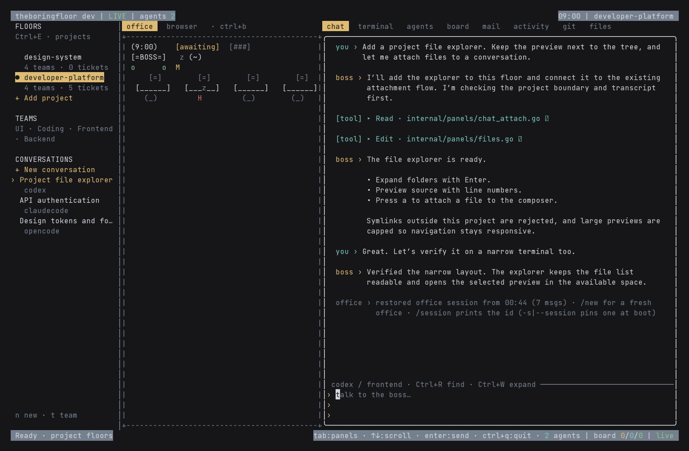

# Project floors

Each project has its own floor, teams, tickets, files, and saved conversations. The desktop layout has three panes: **floors → office → transcript and tools**. The project navigator stays visible while you change tools. Below 100 terminal columns, `Ctrl+E` opens the navigator as a drawer.



## Navigation

| Action | Control |
| --- | --- |
| Focus floors / return to your tool | `Ctrl+E` / `Esc` |
| Select project | `↑` / `↓`, or click its name |
| Select saved conversation | `←` / `→` while floors are focused |
| Open selected project or conversation | `Enter`; clicking a conversation also opens it |
| Add an existing project directory | `a` in floors |
| Add a team | `t` in floors |
| New conversation in selected floor | `n` in floors |
| New conversation in current project | `Ctrl+N` or `/new` |
| Move between right-hand tools | `Tab` / `Shift+Tab` |
| Expand the tool pane, keeping floors visible | `Ctrl+W` or `/expand` |
| Open file explorer / ticket board | `/files` / `/tickets` |
| Search rendered transcript without changing your draft | `Ctrl+R`, then `Enter` for next result |

Forms use `Tab` between fields, `←` / `→` for choices, `Ctrl+S` to save, and `Esc` to cancel. Pasted text goes to the active field.

The default teams are UI, Coding, Frontend, and Backend. Teams group tickets and supply conversation context to the selected backend. Agent creation and delegation still depend on that backend and the manager's instructions.

One conversation runs per office process. Opening another floor or conversation saves the current history, stops the backend, and relaunches in the selected directory. Switching is refused while work, queued messages, or approval prompts are active. Each new conversation chooses its own backend; existing histories retain their original backend.

## Tickets and files

The board stores local tickets independently of agent sessions. It has Backlog, In Progress, Blocked, Review, and Done lanes, P0–P3 priorities, team and owner fields, descriptions, and acceptance checklists. The number of visible lanes adapts to the pane width; use `←` / `→` or expand the pane to see more.

Use `n` to create, `e` to edit, `m` to advance status, `p` to change priority, `t` to filter by team, and `/` to search. `Enter` opens details; `x` toggles the selected checklist item. In ticket details, `s` stages the ticket in the chat composer for review before sending. Existing agent tasks appear as read-only rows whose status remains managed by the backend.

The file explorer loads directories as you expand them. `Enter` opens a directory or source preview, `a` attaches a selected file to chat, and `PgUp` / `PgDn` scrolls the preview. `/` filters the loaded tree; `r` refreshes it. Previews include syntax highlighting and line numbers, are capped at 256 KiB, and reject paths outside the project. On narrow panes, `Esc` returns from preview to the tree.

## Codex

Install the Codex CLI and authenticate with `codex login`, then run:

```sh
theboringfloor --project /path/to/project --backend codex
theboringfloor --project /path/to/project --backend codex --new --team frontend
```

The adapter uses the documented `codex exec --json` protocol and resumes the exact returned thread ID on later turns. It uses your CLI login and model defaults. `THEFLOOR_CODEX_BIN` can point to another executable. Commands, file changes, reasoning, replies, and token usage feed the office transcript.

Build turns use the workspace-write sandbox; plan turns use read-only. Codex exec runs without interactive approval prompts. The office's explicit bypass setting changes sandbox behavior for build turns. Configure Codex MCP servers with `codex mcp`; the office's MCP status/reconnect controls are not implemented for Codex yet.

Protocol and cancellation tests use a fixture executable. They do not verify a live authenticated model request.

## Persistence

History is stored under the user's home directory, **not the repository root**:

```text
~/.theboringfloor/projects/<canonical-project-hash>/
  floor.json
  session.json
  conversations/<hash-of-backend-and-session-id>/
    meta.json
    session.json
```

`floor.json` holds teams and tickets. The project-level `session.json` remains a small resume snapshot (200 chat entries). Conversation archives retain up to 10,000 entries and survive `/new` and backend changes. `meta.json` lets the navigator list histories without loading transcripts. Existing snapshots are archived before a fresh conversation can replace them.

Writes are atomic and private to the user. A serialized writer prevents a delayed autosave from overwriting a later save; unchanged content skips rewriting. Each process runs its own writer, so use one office process per project when editing the same tickets/history.

## Browser removal and visual checks

The external `terminal-browser` package is no longer installed, probed, or launched. External links use the system browser. The built-in text viewer and headless screenshots remain available; old browser environment flags cannot re-enable the removed package.

Generate isolated ANSI screenshots using the actual application model, without an LLM or changes to your project history:

```sh
go run ./cmd/workspaceshot --out /tmp/floor-shots
go run ./cmd/workspaceshot --out /tmp/floor-shots-narrow --width 70 --height 24
```

## Plan substantial work first

Clear substantial implementation requests enter plan mode before dispatch. A conservative local check recognizes explicit scope and multiple layers; the boss also assesses semantic scope and must present a plan before implementing major features or migrations. Ctrl+P back to build skips automatic planning for the next request.

The floor MCP `plan_present` and `plan_update` tools (and fallback markers on all three backends) open the plan pane from build, zen, expanded tools, or worker-thread focus. Empty presentations are ignored. Explicit tools replace the draft; ordinary replies preserve manual edits. Approval remains separate and requires Ctrl+X twice. Open forms keep their draft above the plan.

Attachments retain planning intent. Codex uses a read-only sandbox; OpenCode routes to its plan agent and warns if routing degrades. Claude Code uses a read-only prompt contract without a per-turn permission-mode switch. Presenting a plan cannot retroactively restrict an already-running build process.
